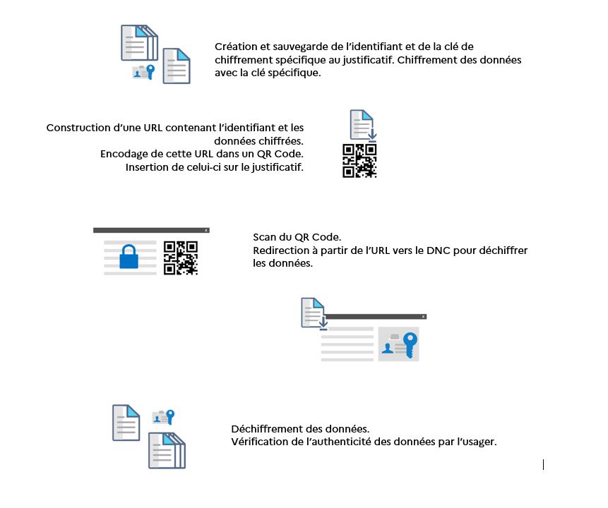

# Usage du QR code pour les attestations du DNC

## Rappel du contexte

Afin de vérifier l’authenticité des justificatifs générés par le DNC sans avoir à stocker des données il a été choisi d’utiliser la technologie du QR Code.

## QR Code

Un QR code est une représentation graphique d'une information. C'est une sorte de code barre à deux dimensions. Ladite information peut contenir du texte, une URL, un e-mail, un numéro de téléphone, une vCard, etc.

## Scénario de l’utilisation du QR Code dans le DNC

Lorsque le DNC génère un justificatif sur demande de l’usager, y est automatiquement apposé un QR Code. Celui-ci contient une URL avec l’identifiant et les données chiffrées du justificatif et est lisible par n’importe quel lecteur de QR Code.

Ainsi, lorsqu’une personne consulte un justificatif reçu et scanne le QR code, il est redirigé sur l’URL. Le DNC déchiffre les données de l’URL avec la clé de chiffrement propre à ce justificatif puis les restitue à l’usager.

Les clés de chiffrement sont propres à chaque justificatif généré et ne sont stockées que durant la période de validité du justificatif (3 mois à partir de la date de génération).

Une fois la période arrivée à échéance la clé de chiffrement est supprimée du serveur et l’URL n’affiche plus les données.

## Technologie

Le DNC utilise la librairie ZXing accessible en suivant le lien : [https://github.com/zxing/zxing](https://github.com/zxing/zxing)

## Taille du QR Code

La quantité totale de caractères est définie par la base de l’URL + l’identifiant + les données chiffrées. Un QR code peut contenir plus ou moins 170 caractères.

